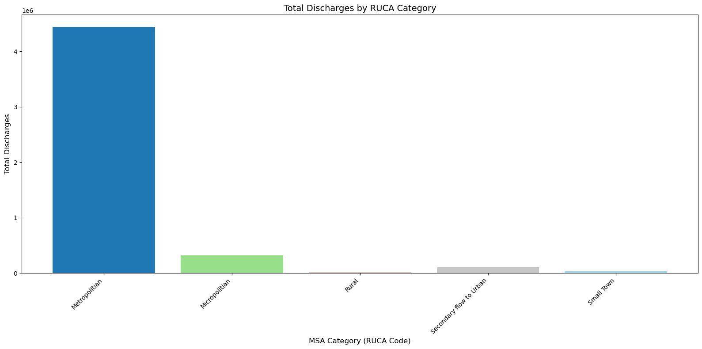

```python
import pandas as pd
import matplotlib.pyplot as plt
import numpy as np


# Replace this with your actual file path!
file_path = r'C:\\Users\\prave\\OneDrive\\Desktop\\College\\Course 8 - Capstone_Business Intelligence and Data Analytics\\Data_set\\Medicare_IP_Hospitals_by_Provider_and_Service_2023.csv'

# Read the CSV file
df3 = pd.read_csv(file_path, encoding='latin1')

# Clean column names just in case
df3.columns = df3.columns.str.strip()

# Preview the first few rows
df3.head()
```


<div>
<style scoped>
    .dataframe tbody tr th:only-of-type {
        vertical-align: middle;
    }

    .dataframe tbody tr th {
        vertical-align: top;
    }

    .dataframe thead th {
        text-align: right;
    }
</style>
<table border="1" class="dataframe">
  <thead>
    <tr style="text-align: right;">
      <th></th>
      <th>Rndrng_Prvdr_CCN</th>
      <th>Rndrng_Prvdr_Org_Name</th>
      <th>Rndrng_Prvdr_City</th>
      <th>Rndrng_Prvdr_St</th>
      <th>Rndrng_Prvdr_State_FIPS</th>
      <th>Rndrng_Prvdr_Zip5</th>
      <th>Rndrng_Prvdr_State_Abrvtn</th>
      <th>Rndrng_Prvdr_RUCA</th>
      <th>Rndrng_Prvdr_RUCA_Desc</th>
      <th>DRG_Cd</th>
      <th>DRG_Desc</th>
      <th>Tot_Dschrgs</th>
      <th>Avg_Submtd_Cvrd_Chrg</th>
      <th>Avg_Tot_Pymt_Amt</th>
      <th>Avg_Mdcr_Pymt_Amt</th>
    </tr>
  </thead>
  <tbody>
    <tr>
      <th>0</th>
      <td>10001</td>
      <td>Southeast Health Medical Center</td>
      <td>Dothan</td>
      <td>1108 Ross Clark Circle</td>
      <td>1</td>
      <td>36301</td>
      <td>AL</td>
      <td>Metropolitian</td>
      <td>Metropolitan area high commuting: primary flow...</td>
      <td>3</td>
      <td>ECMO OR TRACHEOSTOMY WITH MV &gt;96 HOURS OR PRIN...</td>
      <td>14</td>
      <td>$663,764.36</td>
      <td>$120,219.93</td>
      <td>$115,544.14</td>
    </tr>
    <tr>
      <th>1</th>
      <td>10001</td>
      <td>Southeast Health Medical Center</td>
      <td>Dothan</td>
      <td>1108 Ross Clark Circle</td>
      <td>1</td>
      <td>36301</td>
      <td>AL</td>
      <td>Metropolitian</td>
      <td>Metropolitan area high commuting: primary flow...</td>
      <td>23</td>
      <td>CRANIOTOMY WITH MAJOR DEVICE IMPLANT OR ACUTE ...</td>
      <td>26</td>
      <td>$180,980.88</td>
      <td>$37,321.04</td>
      <td>$35,261.81</td>
    </tr>
    <tr>
      <th>2</th>
      <td>10001</td>
      <td>Southeast Health Medical Center</td>
      <td>Dothan</td>
      <td>1108 Ross Clark Circle</td>
      <td>1</td>
      <td>36301</td>
      <td>AL</td>
      <td>Metropolitian</td>
      <td>Metropolitan area high commuting: primary flow...</td>
      <td>24</td>
      <td>CRANIOTOMY WITH MAJOR DEVICE IMPLANT OR ACUTE ...</td>
      <td>12</td>
      <td>$105,824.33</td>
      <td>$26,936.67</td>
      <td>$25,048.92</td>
    </tr>
    <tr>
      <th>3</th>
      <td>10001</td>
      <td>Southeast Health Medical Center</td>
      <td>Dothan</td>
      <td>1108 Ross Clark Circle</td>
      <td>1</td>
      <td>36301</td>
      <td>AL</td>
      <td>Metropolitian</td>
      <td>Metropolitan area high commuting: primary flow...</td>
      <td>25</td>
      <td>CRANIOTOMY AND ENDOVASCULAR INTRACRANIAL PROCE...</td>
      <td>16</td>
      <td>$242,539.50</td>
      <td>$34,745.38</td>
      <td>$32,438.63</td>
    </tr>
    <tr>
      <th>4</th>
      <td>10001</td>
      <td>Southeast Health Medical Center</td>
      <td>Dothan</td>
      <td>1108 Ross Clark Circle</td>
      <td>1</td>
      <td>36301</td>
      <td>AL</td>
      <td>Metropolitian</td>
      <td>Metropolitan area high commuting: primary flow...</td>
      <td>38</td>
      <td>EXTRACRANIAL PROCEDURES WITH CC</td>
      <td>11</td>
      <td>$122,741.18</td>
      <td>$14,999.82</td>
      <td>$9,579.36</td>
    </tr>
  </tbody>
</table>
</div>


```python
# Cleansing of columns
df3.columns = df3.columns.str.strip()

for col in ['Tot_Dschrgs', 'Avg_Tot_Pymt_Amt', 'Avg_Mdcr_Pymt_Amt']:
    df3[col] = pd.to_numeric(df3[col], errors='coerce')

#  Calculate total amounts per row
df3['Total_Tot_Paid'] = df3['Tot_Dschrgs'] * df3['Avg_Tot_Pymt_Amt']
df3['Total_Medicare_Paid'] = df3['Tot_Dschrgs'] * df3['Avg_Mdcr_Pymt_Amt']

# Group by MSA category (RUCA description)
grouped_counts = df3.groupby('Rndrng_Prvdr_RUCA')['Tot_Dschrgs'].sum().sort_index()

plt.figure(figsize=(16, 8))

x_labels = grouped_counts.index.astype(str)
x_pos = np.arange(len(x_labels))

# For colored bars
colors = plt.cm.tab20(np.linspace(0, 1, len(x_labels)))

# Plot each bar with a unique color
bars = plt.bar(x_pos, grouped_counts.values, color=colors)

plt.xlabel('MSA Category (RUCA Code)', fontsize=12)
plt.ylabel('Total Discharges', fontsize=12)
plt.title('Total Discharges by RUCA Category', fontsize=14)
plt.xticks(x_pos, x_labels, rotation=45, ha='right')

plt.tight_layout()
plt.show()
```


    

    


```python

```
